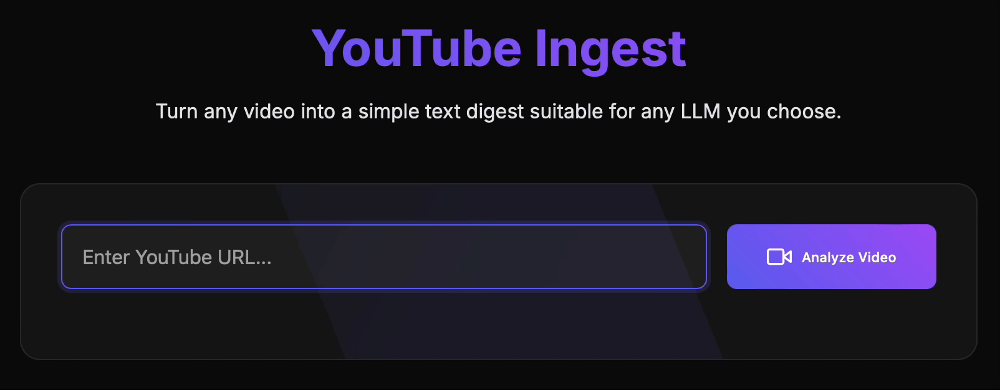

# YouTube Ingest

YouTube Ingest is a web application designed to convert videos from YouTube or other platforms into a text digest tailored for integration with any LLM.

The backend leverages the power of both the [`youtube_transcript_api`](https://github.com/jdepoix/youtube-transcript-api/tree/master) and [`yt_dlp`](https://github.com/yt-dlp/yt-dlp) libraries to fetch video descriptions and transcripts seamlessly. On the frontend, the application is built using [FastHTML](https://github.com/AnswerDotAI/fasthtml), with dynamic HTML templates rendered via [Jinja2](https://github.com/pallets/jinja/), allowing session-specific content to be presented to users.

For videos where the transcript is not directly available on YouTube, we utilize [`whisper`](https://github.com/openai/whisper) to extract the audio and subsequently obtain its transcription.



## Build and Run

Build the Docker Image:

```bash
docker build -t youtube-ingest-app .
````

Run the Docker Container:

```bash
docker run -p 5001:5001 youtube-ingest-app
```

The application will be accessible on port 5001.

## Contributing

## Contributing

You can contribute to YouTube Ingest in various ways:

- **Provide Feedback:**  
  [Create an issue](https://github.com/alexfdom/youtube-ingest/issues/new) on GitHub to suggest new features or report bugs.

- **Share the Project:**  
  Spread the word about YouTube Ingest with anyone who might find it useful.

